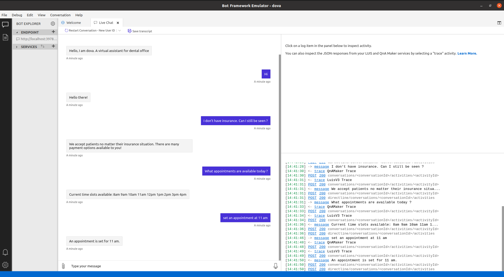

# DOVA: Dental Office Virtual Assistant

Dental Office Virtual Assistant

## Getting Started

The repository contains all the work related to the "Dental office virtal assistant" project from the Azure AI Engineer Nanodegree. The respository contains multiple branches to make the separate CI/CD deployment of each of the part as listed below. The required workflow yml files for each part is present in the respective branch of the repository.

* [ContosoDentistryChatBot](https://github.com/SHANK885/nd073-c2-Dental-Office-Virtual-Assistant/tree/ContosoDentistryChatBot)
* [ContosoDentistryScheduler](https://github.com/SHANK885/nd073-c2-Dental-Office-Virtual-Assistant/tree/ContosoDentistryScheduler)
* [ContosoDentistryWebsite](https://github.com/SHANK885/nd073-c2-Dental-Office-Virtual-Assistant/tree/ContosoDentistryWebsite)

## Website

Plase visit the below link to test the virtual assitant and interact with it.

[Dental Office Virtual Assistant](https://jolly-tree-02dc31910.azurestaticapps.net)


## Dependencies

```
Examples here
```

## Installation

Step by step explanation of how to get a dev environment running.


```
npm install
```

## Testing

For testing the bot locally.

1. Download the Microsoft Bot Framework Emulator
2. Run the below command

    ```
    npm start
    ```
3. Open the Bot Framework Emulator and load the bot using the below provided URL.
    ```
    http://localhost:3978/api/messages
    ```

## Test Results

### 1. Bot Code


### 2. Knowledge Base


### 3. LUIS App


### 4. Github CI/CD


### 5. Portal Bot Test


### 6. Website Bot Test


### 7. Local Bot test



### Break Down Tests

Explain what each test does and why

```
Examples here
```

## Project Instructions

This section should contain all the student deliverables for this project.

## Built With

* [Item1](www.item1.com) - Description of item
* [Item2](www.item2.com) - Description of item
* [Item3](www.item3.com) - Description of item

Include all items used to build project.

## License

[License](LICENSE.txt)
